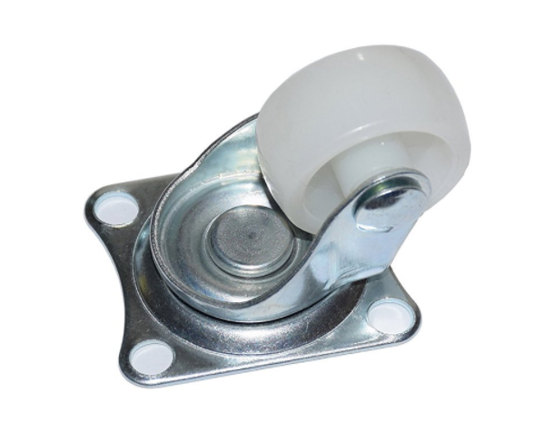

# Hardware Checklist

Step 1

If you mounted the Raspberry Pi on top, check that a pin protector is mounted on the pins of the hut to prevent pins from shorting out. If no protector is installed yet, then first check that no pins are bent or are making contact and then add the protector. It should slide into place without applying any force. The stl file to 3D print the pin protector can be found in Section 1.2 - Adding hardware to the bot.

Step 3

Check if the standoff on the Duckiebot is mounted and an April tag matching the Duckiebot name (hostname) is attached. The April tag needs to be aligned with the front of the top plate and centered. On the top plate you will find engraved lines that show you where to position it. the standoff needs to be mounted in the very front of the bot. A picture can be found in Figure 1.4

Step 4

Check if a rubber duckie sits on the bot. If not, put one on it now. As the rubber duckies are rather bad at balancing and lack hands to hold on to the Duckiebot, use double sided tape to fix it to the Duckiebot.

Step 5

Make sure the back bumper is properly fastened to the Duckiebot (no wiggling allowed).

Step 6

Check that no cables can interfere with the wheels of the Duckiebot. If necessary, use zip-ties to fix everything properly.

Step 7

Check that all cables are properly attached. Especially check that the camera cable is plugged in correctly and locked. When the Autobot is on, a small red light appears on the camera. Note that it can sometimes appear but still the camera is badly connected.

## HW specifications

#Computation
RPI 3B

     

RPI 3B+

     

RPI 4B

     

#Actuation

Hut:
Stepper Hat:

     

Duckiebot Hut:

     

Motors:
DG01D dual-axis drive gear (48:1):
So called Dagu Motor 48:1 (Yellow Motors)

     

Blue Motors with embedded hall effect sensors

     

Front Wheels:
Type 1:

     

Type 2:

     

Type 3:

     

Back Wheels:
Caster:

     

Omni:

     

LEDs:
TODO

#Sensing
Waveshare Raspberry Pi Camera Module Kid 1080P with 160-FOV Fisheye Lens

Caster:

     

#Battery:

RAVPOWER RP-PB07:
The so called standard white battery

     

Duckiebattery v. 1.0:

     

     

#Memory:
SDCard:
At Duckietown SanDisks are used similar to the one used below:

     

They can have the size: 16GB, 32 GB, 64 GB, 128 GB, 256 GB
Type can be: U1 Class 10 or U3 class 10

#Chassis:

Magician Red Chassis:

     

